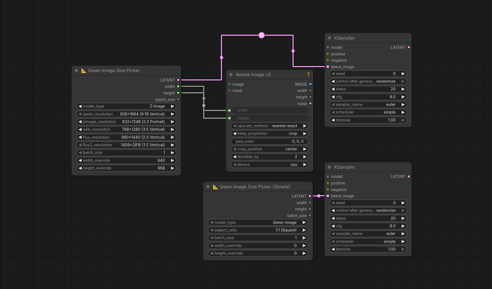

# 📐 Qwen Image Empty Latent Size Picker for ComfyUI

A ComfyUI node that creates empty latents with preset sizes for Qwen-Image, Z-Image, SDXL, Flux, and Flux2 models. Includes common resolutions for each model and allows custom size overrides.



## Features

### Two Node Types:

**📐 Qwen Image Size Picker (Original)**
- Pre-configured resolution lists for each model (Qwen-Image, Z-Image, SDXL, Flux, Flux2)
- Select specific resolutions from comprehensive dropdowns
- Custom size overrides (width/height)
- Batch size control
- Outputs: LATENT, width, height, batch_size

**📐 Qwen Image Size Picker (Simple)**
- Model type selection (Qwen-Image, Z-Image, SDXL, Flux, Flux2)
- Aspect ratio selection (1:1, 16:9, 9:16, 4:3, 3:4, 3:2, 2:3)
- Automatically selects the optimal resolution for your chosen model and aspect ratio
- Custom size overrides (width/height)
- Batch size control
- Outputs: LATENT, width, height, batch_size

### Supported Models:

| Model | Description | Resolution Range |
|-------|-------------|------------------|
| **Qwen-Image** | Alibaba's Qwen image generation model | 928×1664 to 1664×928 |
| **Z-Image** | Tongyi-MAI's flexible aspect ratio model | 720×1280 to 1600×900 |
| **SDXL** | Stable Diffusion XL | 704×1408 to 1728×576 |
| **Flux** | Black Forest Labs Flux | 512×512 to 1536×1536 |
| **Flux2** | Flux.1 Pro/Dev (2x SDXL) | 1408×2816 to 3456×1152 |

## Installation

1. Clone into your ComfyUI custom_nodes folder:
```bash
cd ComfyUI/custom_nodes
git clone https://github.com/rzgarespo/ComfyUI-qwen-image-size-picker.git
```

2. Restart ComfyUI

## Usage

### Original Node
1. Add **📐 Qwen Image Size Picker** to your workflow
2. Select your model type (e.g., Qwen-Image, SDXL, Flux)
3. Choose a specific resolution from the model's dropdown list
4. Adjust batch size if needed
5. Use width/height override to customize (optional)

### Simple Node
1. Add **📐 Qwen Image Size Picker (Simple)** to your workflow
2. Select your model type
3. Select an aspect ratio (e.g., 16:9 for landscape, 9:16 for portrait)
4. The node automatically picks the optimal resolution for your model
5. Adjust batch size if needed
6. Use width/height override to customize (optional)

## Outputs

All nodes provide four outputs:
- **LATENT** - Empty latent tensor for image generation
- **width** - Width in pixels (INT)
- **height** - Height in pixels (INT)
- **batch_size** - Number of images (INT)

## Z-Image Note

Z-Image is flexible with aspect ratios. The resolutions used are optimized for 1-2 megapixel range, staying within the official 512-2048 pixel guideline. Common aspect ratios are prioritized based on official examples and community recommendations.

## License

MIT License
