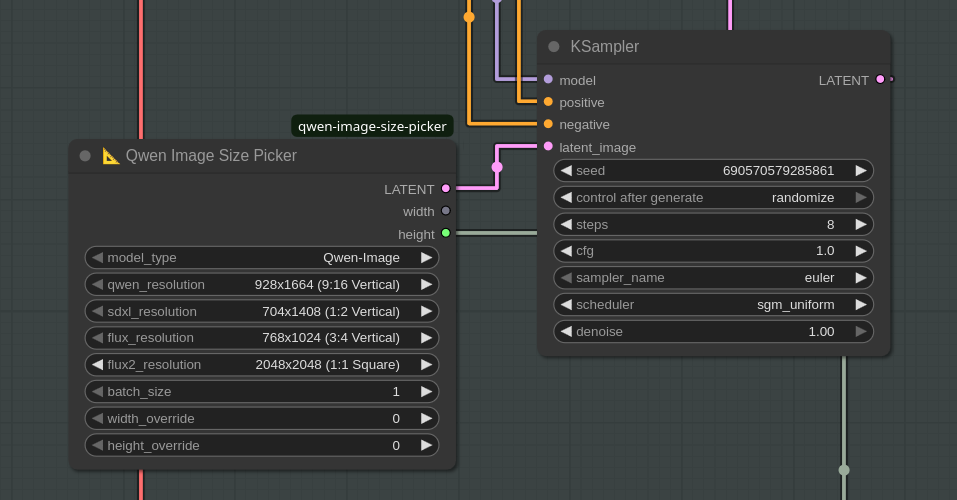

# 📐 Qwen Image Empty Latent Size Picker for ComfyUI

A simple ComfyUI node that creates empty latents with preset sizes for Qwen Image, SDXL and Flux models. Includes common resolutions for each model and allows custom size overrides.


## Features

- Pre-configured sizes for Qwen-Image, SDXL and Flux
- Custom size overrides
- Batch size control


## Installation

1. Clone into your ComfyUI custom_nodes folder:
```bash
cd ComfyUI/custom_nodes
git clone https://github.com/rzgarespo/ComfyUI-qwen-image-size-picker.git
```

2. Restart ComfyUI

## License

MIT License
